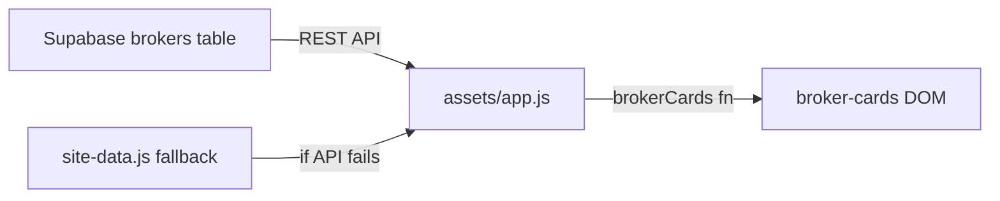
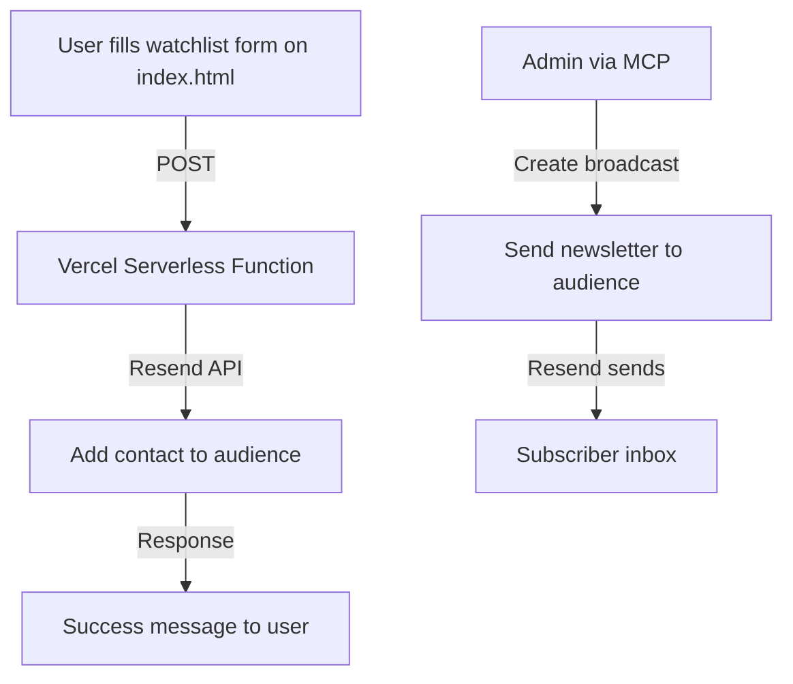

# IPO Watch Africa — Contact, Broker Database & Mailing List Plan

## 1. Site-wide Email Placement

**Email:** `admin@ipowatchafrica.com`

Currently the site has **zero** email references — no `mailto:` links, no email addresses in any page content, privacy policy, or footer. The contact form uses `data-demo-form` which only shows a placeholder message on submit.

### Pages requiring email additions

| Page | Where to add | Purpose |
|------|-------------|---------|
| [`contact.html`](contact.html) | Visible email link above/beside the form + in "Before you write" card | Primary contact point |
| [`privacy.html`](privacy.html) | New "Contact for data enquiries" card | GDPR/data protection contact |
| [`terms.html`](terms.html) | New "Questions" card | Terms-related enquiries |
| [`advertise.html`](advertise.html) | In the media kit form section or beside it | Advertising enquiries |
| [`editorial-policy.html`](editorial-policy.html) | In "Corrections" card | Editorial corrections |
| [`about.html`](about.html) | New "Get in touch" card | General contact |
| **All footers** | Email link in footer-links div | Universal fallback |
| [`index.html`](index.html) | Footer + watchlist section note | Join updates + contact |

### Footer update approach

The [`footer()`](scripts/build-site.mjs:585) function in the build script generates footers. Update it to include:

```html
<a href="mailto:admin@ipowatchafrica.com">admin@ipowatchafrica.com</a>
```

This goes in the `footer-links` div, after the "Contact" link. Then rebuild all pages.

### Contact form enhancement

Update the [`initForms()`](assets/app.js:173) function to show the email address in the placeholder message, so even if the form is not yet connected to a backend, users see the email:

```js
if (message) message.textContent = "Form received. You can also email us directly at admin@ipowatchafrica.com.";
```

---

## 2. Broker Database — Supabase Setup

### Why Supabase

- User already has Supabase experience
- Free tier: 500MB database, 50K monthly API requests
- REST API works directly from static site JavaScript
- Row Level Security for data protection
- Real-time subscriptions if needed later
- MCP server available for AI-assisted management

### Database schema

```sql
-- Broker directory table
create table brokers (
  id uuid default gen_random_uuid() primary key,
  name text not null,
  slug text not null unique,
  countries text[] not null default '{}',
  exchanges text[] not null default '{}',
  regulator text,
  licence_number text,
  minimum text,
  fees text,
  ipo_access text default 'Not confirmed',
  diaspora boolean default false,
  regulated boolean default false,
  sponsored boolean default false,
  website_url text,
  description text,
  logo_url text,
  contact_email text,
  is_active boolean default true,
  sort_order int default 0,
  created_at timestamptz default now(),
  updated_at timestamptz default now()
);

-- Enable RLS
alter table brokers enable row level security;

-- Public read-only policy
create policy "Brokers are publicly readable"
  on brokers for select
  using ( is_active = true );

-- Admin write policy - replace with your auth user ID
create policy "Admins can manage brokers"
  on brokers for all
  using ( auth.uid() = 'YOUR_ADMIN_USER_ID' );
```

### Migration from static data

Currently brokers are hardcoded in [`site-data.js`](assets/site-data.js:32). The migration path:

1. Create the Supabase table and insert the 3 existing brokers
2. Create a thin API wrapper in `assets/app.js` that fetches from Supabase
3. Keep `site-data.js` as a fallback if the API call fails
4. Update [`brokerCards()`](assets/app.js:102) to use Supabase data

### Data flow



### Supabase MCP setup

Add to your MCP configuration:

```json
{
  "mcpServers": {
    "supabase": {
      "command": "npx",
      "args": ["-y", "@supabase/mcp-server-supabase"],
      "env": {
        "SUPABASE_ACCESS_TOKEN": "your-access-token",
        "SUPABASE_PROJECT_ID": "your-project-id"
      }
    }
  }
}
```

This lets you manage brokers via AI tools — add, update, remove brokers without touching code.

---

## 3. Mailing List — Recommended: Resend

### Why Resend over alternatives

| Feature | Resend | Loops | Mailchimp |
|---------|--------|-------|-----------|
| Native MCP server | Yes | No direct MCP | Community only |
| Contact management via MCP | Yes | API only | Limited |
| Broadcast/newsletter via MCP | Yes | Yes | Yes |
| Free tier | 100 emails/day, 1 audience | 500 contacts free | 500 contacts |
| Supabase integration | Via API | Native | Via Zapier |
| Static site friendly | Yes | Yes | Yes |
| Transactional emails | Yes | Yes | Limited |

**Resend wins** because it has a native MCP server that lets you manage contacts, audiences, broadcasts, and segments directly from AI tools — no context switching.

### Resend setup steps

1. **Create account** at [resend.com](https://resend.com)
2. **Verify domain** — add DNS records for `ipowatchafrica.com`
3. **Create an audience** — e.g. "IPO Watch Africa Subscribers"
4. **Get API key** — store as environment variable
5. **Set up MCP server** — add to your MCP config

### Resend MCP configuration

The MCP server package is `resend-mcp`. Set up via CLI:

```bash
claude mcp add resend -e RESEND_API_KEY=re_xxxxxxxxx -- npx -y resend-mcp
```

Or manually in your MCP config:

```json
{
  "mcpServers": {
    "resend": {
      "command": "npx",
      "args": ["-y", "resend-mcp"],
      "env": {
        "RESEND_API_KEY": "re_your_api_key"
      }
    }
  }
}
```

Optional flags: `--sender admin@ipowatchafrica.com` to set a default sender, `--reply-to admin@ipowatchafrica.com` for reply-to.

### What the Resend MCP can do

- **Contacts**: Create, list, update, remove contacts
- **Audiences**: Manage subscriber lists
- **Broadcasts**: Create and send newsletter campaigns with scheduling
- **Segments**: Create targeted segments for specific audiences
- **Emails**: Send transactional emails directly

### Newsletter signup flow



### Vercel serverless function for form handling

Create `api/subscribe.js`:

```js
export default async function handler(req, res) {
  if (req.method !== 'POST') {
    return res.status(405).json({ error: 'Method not allowed' });
  }

  const { email, country, investorType } = req.body;

  if (!email) {
    return res.status(400).json({ error: 'Email is required' });
  }

  const response = await fetch('https://api.resend.com/contacts', {
    method: 'POST',
    headers: {
      'Authorization': `Bearer ${process.env.RESEND_API_KEY}`,
      'Content-Type': 'application/json'
    },
    body: JSON.stringify({
      email,
      audience_id: process.env.RESEND_AUDIENCE_ID,
      first_name: '',
      custom_fields: { country, investor_type: investorType }
    })
  });

  if (response.ok) {
    return res.status(200).json({ success: true });
  }

  return res.status(500).json({ error: 'Failed to subscribe' });
}
```

### Contact form serverless function

Create `api/contact.js`:

```js
import { Resend } from 'resend';

const resend = new Resend(process.env.RESEND_API_KEY);

export default async function handler(req, res) {
  if (req.method !== 'POST') {
    return res.status(405).json({ error: 'Method not allowed' });
  }

  const { name, email, topic, message } = req.body;

  const { data, error } = await resend.emails.send({
    from: 'IPO Watch Africa <noreply@ipowatchafrica.com>',
    to: ['admin@ipowatchafrica.com'],
    reply_to: email,
    subject: `[IPO Watch Contact] ${topic}: ${name}`,
    text: `Name: ${name}\nEmail: ${email}\nTopic: ${topic}\n\n${message}`
  });

  if (error) {
    return res.status(500).json({ error: error.message });
  }

  return res.status(200).json({ success: true });
}
```

---

## 4. Complete MCP Configuration

Combined `mcp.json` for the full stack:

```json
{
  "mcpServers": {
    "supabase": {
      "command": "npx",
      "args": ["-y", "@supabase/mcp-server-supabase"],
      "env": {
        "SUPABASE_ACCESS_TOKEN": "your-supabase-token",
        "SUPABASE_PROJECT_ID": "your-project-id"
      }
    },
    "resend": {
      "command": "npx",
      "args": ["-y", "resend-mcp"],
      "env": {
        "RESEND_API_KEY": "re_your_api_key"
      }
    }
  }
}
```

With this setup you can:
- **Via Supabase MCP**: Add/edit/remove brokers, query broker data, manage the directory
- **Via Resend MCP**: Manage subscribers, create and send newsletters, handle contact form emails, segment audiences

---

## 5. Implementation Order

### Phase 1 — Email on site (immediate, no backend needed)

1. Add `admin@ipowatchafrica.com` to all pages listed above
2. Update [`footer()`](scripts/build-site.mjs:585) in build script to include email
3. Update [`initForms()`](assets/app.js:173) placeholder message to show email
4. Rebuild and deploy

### Phase 2 — Resend setup (mailing list)

1. Create Resend account, verify domain
2. Create audience for IPO Watch subscribers
3. Set up Resend MCP server
4. Create Vercel serverless functions for form handling
5. Update [`initForms()`](assets/app.js:173) to POST to serverless endpoints
6. Test end-to-end: form → API → Resend → subscriber added

### Phase 3 — Supabase broker database

1. Create Supabase project
2. Run the broker table migration SQL
3. Insert existing brokers from [`site-data.js`](assets/site-data.js:32)
4. Set up Supabase MCP server
5. Update [`assets/app.js`](assets/app.js) to fetch brokers from Supabase with fallback
6. Test and deploy

### Phase 4 — Ongoing via MCP

Once set up, daily operations become:

- **Add a broker**: Ask AI to insert into Supabase via MCP
- **Send newsletter**: Ask AI to create a Resend broadcast via MCP
- **Check subscribers**: Ask AI to list Resend contacts via MCP
- **Update broker info**: Ask AI to update Supabase records via MCP

---

## 6. Environment Variables for Vercel

```
RESEND_API_KEY=re_your_api_key
RESEND_AUDIENCE_ID=your_audience_id
SUPABASE_URL=https://your-project.supabase.co
SUPABASE_ANON_KEY=your_anon_key
```

---

## 7. Cost Summary

| Service | Free Tier | Paid Tier |
|---------|-----------|-----------|
| Supabase | 500MB DB, 50K API req/mo | $25/mo for more |
| Resend | 100 emails/day, 1 audience | $20/mo for more |
| Vercel | 100K serverless invocations/mo | $20/mo for more |

All three free tiers are sufficient to get started and likely cover initial launch traffic.
